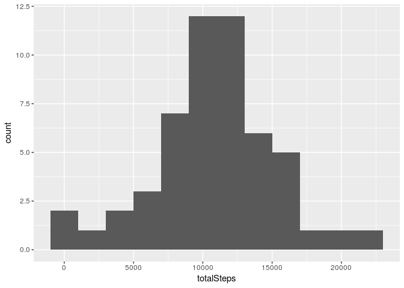
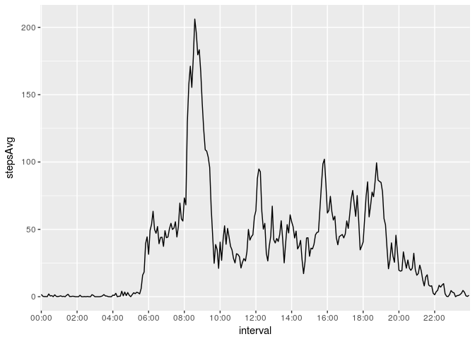
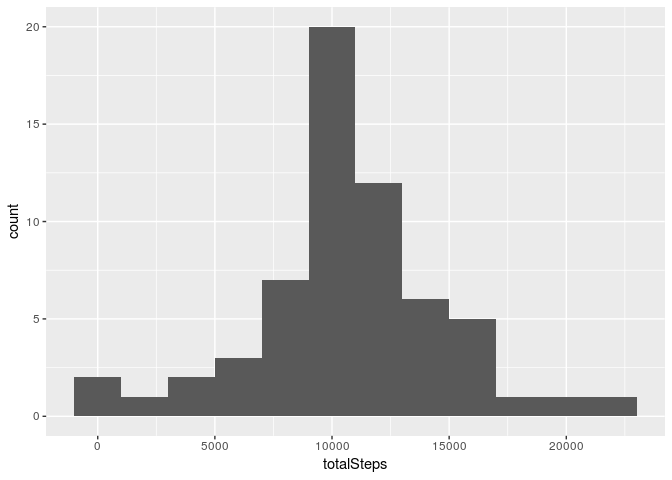
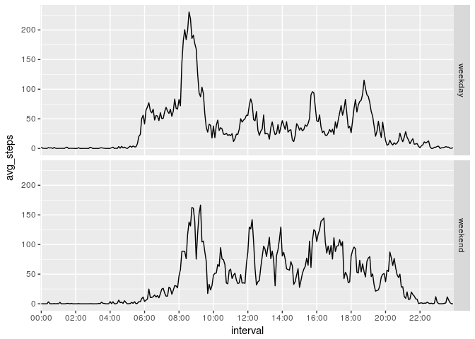

# PA1_template.Rmd
Sergey Sambor  
April 26, 2017  


## Libraries needed for this analysis

```r
library(ggplot2)
library(dplyr)
```

__tickMarks__ a simple assistant function for plotting

```r
# tickMarks returns n tick marks used for time axis
tickMarks <- function (intervals, n) {
    intervals[seq(1, length(intervals), length(intervals)/n )]
}
```

## Data
The variables included in this dataset are:  

* __steps__: Number of steps taking in a 5-minute interval (missing values are coded as NA)
* __date__: The date on which the measurement was taken in YYYY-MM-DD format
* __interval__: Identifier for the 5-minute interval in which measurement was taken  

The dataset is stored in a comma-separated-value (CSV) file and there are a total of 17,568 observations in this dataset.

```r
unzip("../activity.zip", exdir = "../data")
data0 <- read.csv("../data/activity.csv", colClasses = c("numeric", "Date", "numeric"))
data0 <- mutate(data0, 
    interval = gsub('^(.{2})(.*)$', #split to 2 groups with 2 numbers each
                    '\\1:\\2', #insert a colon symbol
                    sprintf("%04d", interval ) )) #add leading zeros
data0$interval <- as.factor(data0$interval)
```
Now 

* __steps__: numeric (integer) value
* __date__: Date value
* __interval__: a factor, in a form of "01:00", "08:00", "14:00"  

## The total number of steps taken each day
Allmost always the number of steps each day lays in between 7500 and 17000 steps.
The most frequent total numbers are inside [9000;13000]

```r
daysTotalSteps <- data0 %>% 
    group_by(date) %>% 
    summarize(totalSteps = sum(steps))
qplot(totalSteps, data = daysTotalSteps, binwidth=2000)
```

<!-- -->

Whilst mean and median number are, respectively

```r
mean(daysTotalSteps$totalSteps, na.rm = TRUE)
```

```
## [1] 10766.19
```

```r
median(daysTotalSteps$totalSteps, na.rm = TRUE)
```

```
## [1] 10765
```

## Average number of steps taken across the day
The most steps are taken between 8 and 9 hours.

```r
periodStepsAvg <- data0 %>% 
    group_by(interval) %>% 
    summarise(stepsAvg = mean(steps, na.rm = TRUE))
ggplot(periodStepsAvg, aes(x=interval, y=stepsAvg, group=1)) +
    geom_line() +
    scale_x_discrete(breaks = tickMarks(periodStepsAvg$interval, 12))
```

<!-- -->

And the period with the highest average number is 8:35

```r
periodStepsAvg[which.max(periodStepsAvg$stepsAvg),]
```

```
## # A tibble: 1 × 2
##   interval stepsAvg
##     <fctr>    <dbl>
## 1    08:35 206.1698
```

## Imputing missing data
The total number of missing data is

```r
sum(is.na(data0$steps))
```

```
## [1] 2304
```

For imputing missing data we use the average value for the same 5-min interval during two months period.

```r
data1 <- mutate(data0, 
    steps = round(ifelse(#replace NAs with steps' average for this inverval
        is.na(steps),
        periodStepsAvg$stepsAvg[which(periodStepsAvg$interval %in% interval)], 
        steps
        )))
```

### The new histogram of the total number of steps taken each day has changed slightly
Now it's the [9000;11000] steps are clearly the most frequent total number per day

```r
daysTotalSteps <- data1 %>% 
    group_by(date) %>% 
    summarize(totalSteps = sum(steps))
qplot(totalSteps, data = daysTotalSteps, binwidth=2000)
```

<!-- -->

Whilst mean and median number, respectively, almost the same

```r
periodStepsAvg <- data1 %>% 
    group_by(interval) %>% 
    summarise(stepsAvg = mean(steps, na.rm = TRUE))
mean(daysTotalSteps$totalSteps, na.rm = TRUE)
```

```
## [1] 10765.64
```

```r
median(daysTotalSteps$totalSteps, na.rm = TRUE)
```

```
## [1] 10762
```

##  Activity patterns in weekdays and weekends
Weekends activity differs to weekdays activity. There's no such a big peak of activity between 8 and 9 hour, but there is more activity throughout the day. Also there's much more activity in the evening on the weekend comparing to weekdays.

```r
data1 <- mutate(data1, 
    daytype = as.factor(ifelse(
        grepl("Sun|Sat", weekdays(date)), 
        "weekend", 
        "weekday")))
weekends <- data1 %>% 
    group_by(daytype, interval) %>% 
    summarize(avg_steps = mean(steps))
ggplot(weekends, aes(x=interval, y=avg_steps, group=daytype))+
    facet_grid(daytype~.)+
    geom_line()+
    scale_x_discrete(breaks = tickMarks (weekends$interval, 24))
```

<!-- -->
